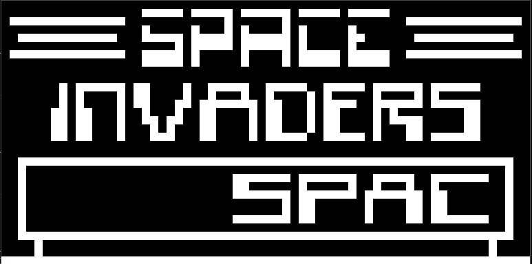

# Chippy

A Chip 8 interpreter made with C that uses raylib for graphics and inputs.
---

### Some screenshots

 

 

 

 To build: 

 

 make

 

To run: 

 

cd bin && ./chippy assets/roms/THE-GAME.ch8

 

### Articles that were helpful
[Cowgod's Technical Chip 8 Reference](http://devernay.free.fr/hacks/chip8/C8TECH10.HTM)
[Guide to Making a Chip 8 Interpreter](https://tobiasvl.github.io/blog/write-a-chip-8-emulator/)
